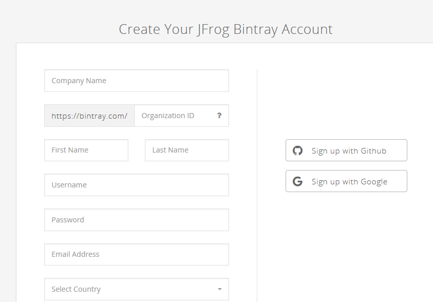
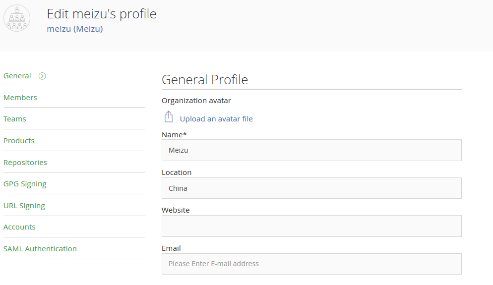
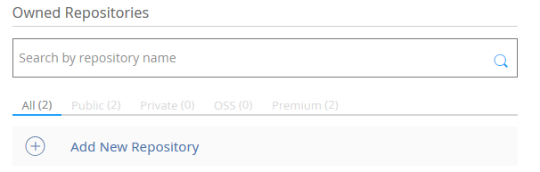
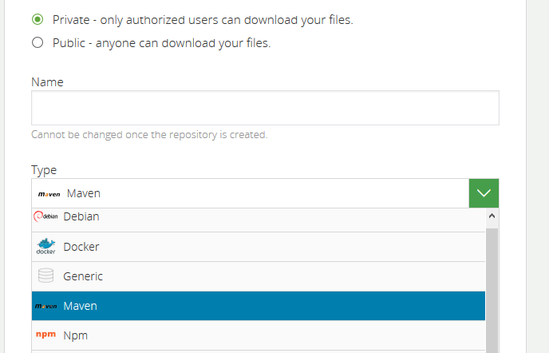
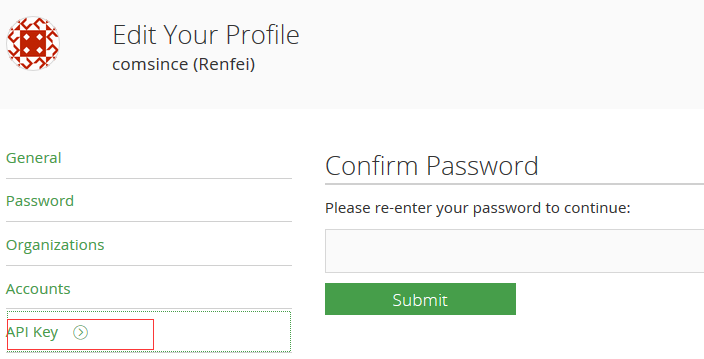

# Jcenter注册申请步骤

## 一.注册

* 打开如下网址[注册](https://bintray.com/signup)



**NOTE:** 填写上面的信息，点击注册即可

## 二.创建群组


**NOTE:**　注册成功后会引导你进行group群组创建,不要在企业试用版下创建group，这个group只有一个月的试用期；你可以申请完bintray账户后,单独申请一个Group

## 三.创建Repository

### 3.1 进入个人主页主导repository的创建入口



### 3.2 点击"Add new Repository",进入详细的页面



**NOTE:** 选择```Maven```类型的仓库

## 四. 账号信息

### 4.1 群组获取
群组即是你注册时填写的group名称

### 4.2 API_KEY获取


